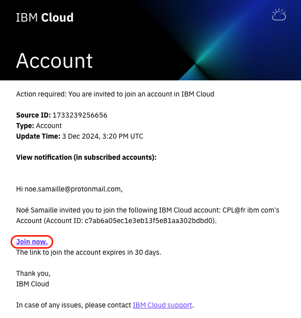
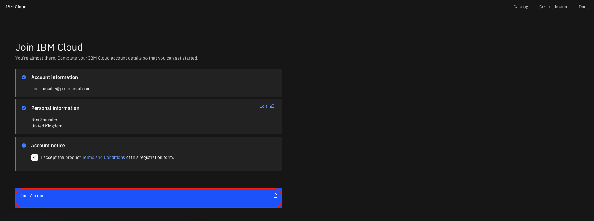
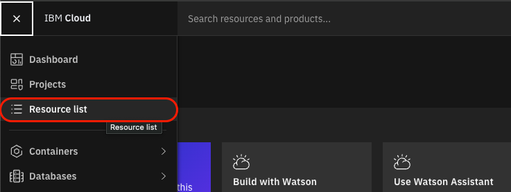
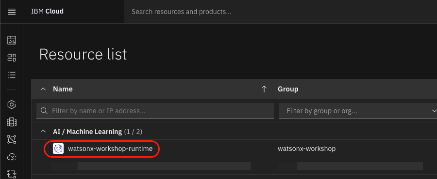
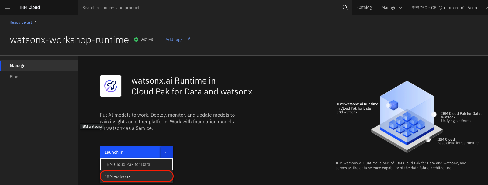
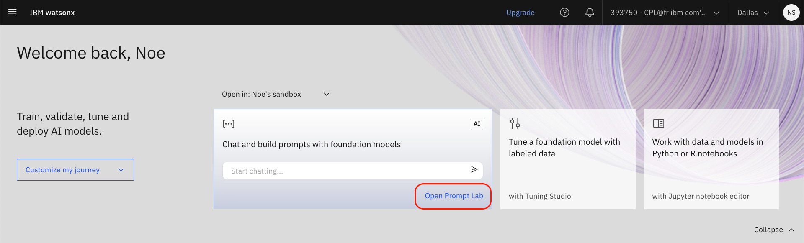

## Logging onto watsonx.ai

1. Check your email and look for an invitation to join an IBM Cloud account. Open that email and click **Join now**.

    

2. You will now be sent to the IBM Cloud login page. Use your IBMid to log in. You are asked to join the IBM Cloud account. Accept the Terms and Conditions, then click **Join Account**.

    

3. You should now be at the IBM Cloud dashboard, otherwise Go to https://www.ibm.com/cloud and click **Log in**.

4.  Click the hamburger menu on the upper left and click **Resource List**.

    

5. Go to the **AI / Machine Learning** resources and click your **watsonx.ai Runtime** service.

    

5. In the service view, click **Lauch In** and then select **IBM watsonx**.

    

    - **Note:** when the setup for watsonx.ai access start, wait for setup form information to be automatically completed and click **Continue**.

6.  If you do not see Launch, enter the following into the URL: https://dataplatform.cloud.ibm.com

After completing the setup phase to access watsonx, you are now in the watsonx.ai console and ready to begin the labs!

